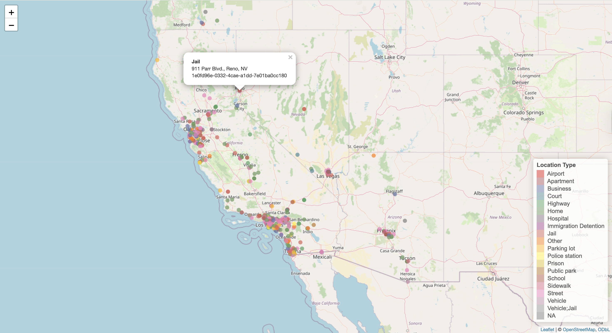

# Legal Complaint Extraction Pipeline

A pipeline for extracting structured data from federal civil rights complaint documents using LLMs. Raw complaint text extracted from complaint PDFs via Lex Machina is fed through a structured prompt, and the JSON outputs are parsed into relational tables for analysis.


---

## Project Structure

**NOTE:** The included dataset is built on a sample of 500 extracted complaints.

```
project/
├── data/
│   ├── filtered_cases.csv              # Cleaned case metadata from Lex Machina
│   ├── filtered_texts.csv              # Complaint texts matched to cases
│   ├── text_documents.csv              # All text file metadata
│   ├── pdf_documents.csv               # All PDF file metadata
│   ├── openai_extracted_text/          # Raw LLM JSON outputs (.txt), one per complaint
│   ├── incidents_extract.csv           # Parsed incidents
│   ├── plaintiffs_extract.csv          # Parsed plaintiffs
│   ├── defendants_extract.csv          # Parsed defendants
│   ├── harms_extract.csv               # Parsed harms (raw)
│   ├── harms_plaintiffs.csv            # Harms joined to plaintiff details
│   └── harms_defendants.csv            # Harms joined to defendant details
├── 01_data_prep.R                      # Loads and cleans Lex Machina case + document data
├── 02_extraction.py                    # Runs LLM extraction across all complaint texts
├── 03_parse.py                         # Parses JSON outputs into relational tables
├── 04_analysis.R                       # Conducts preliminary analysis on the data
└── prompt.txt                          # Extraction prompt template
```

---

## Pipeline Overview

```
Lex Machina downloads (.xls + complaint files)
         │
         ▼
  01_data_prep.R
  ─────────────────────────────────────────────────────────
  • Loads and deduplicates case metadata from Lex Machina exports
  • Extracts state from court name
  • Generates stable case_id and document_id MD5 hashes
  • Reads and decompresses complaint text (.gz)
  • Filters to cases filed and terminated before 2025
  • Outputs: filtered_cases.csv, filtered_texts.csv
         │
         ▼
  02_extraction.py
  ─────────────────────────────────────────────────────────
  • Reads filtered_texts.csv
  • Fills complaint text into prompt.txt template
  • Sends prompts to enabled LLMs asynchronously
  • Skips already-processed files automatically
  • Saves one .txt JSON output per complaint per model
  • Outputs: data/{model}_extracted_text/*.txt
         │
         ▼
  03_parse.py
  ─────────────────────────────────────────────────────────
  • Parses each .txt file from JSON into DataFrames
  • Joins document_id and case_id via file_id
  • Explodes harms and joins to plaintiff/defendant details
  • Outputs: 6 CSV tables (see Data Model below)

  04_analysis.R
  ─────────────────────────────────────────────────────────
  • Geolocates the incidents using the Google Geolocation API
  • Makes summaries for all categorical variables
  • Creates a harm co-occurrence matrix


```

---

## Step 1: Data Preparation (`01_data_prep.R`)

Loads three batches of federal district court cases from Lex Machina exports, cleans and deduplicates them, and links them to downloaded complaint files.

**Key outputs:**

- `filtered_cases.csv` — one row per case, with `case_id`, court, filing/termination dates, and case length
- `filtered_texts.csv` — one row per complaint text file, with `file_id`, `document_id`, `case_id`, and extracted text content

**ID generation:** `case_id` and `document_id` are MD5 hashes of court + case number (+ document numbers), producing stable, reproducible IDs across runs. `file_id` is an MD5 hash of the raw filename.

---

## Step 2: LLM Extraction (`02_extraction.py`)

Sends each complaint through `prompt.txt` and saves the raw JSON response as a `.txt` file.

**Supported models:**

| Key | Model | Provider |
|-----|-------|----------|
| `openai` | gpt-4o-mini | OpenAI |
| `claude` | claude-3-5-sonnet-20241022 | Anthropic |
| `gemini` | gemini-2.5-flash-lite | Google |
| `llama` | Llama-3.3-70B-Instruct | HuggingFace |
| `deepseek` | DeepSeek-V3.2 | HuggingFace |

Enable or disable models in the `MODELS` config block. All enabled models run simultaneously.

**Key parameters:**

| Parameter | Default | Description |
|-----------|---------|-------------|
| `BATCH_SIZE` | 15 | Max concurrent requests per model |
| `BATCH_DELAY` | 1 | Seconds between batches |
| `max_tokens` | 16384 | Max output tokens per request |

**Output files** are saved to `data/{model}_extracted_text/` and named `{file_id}_{model_name}_{timestamp}.txt`. A `summary_{timestamp}.json` per model and a `combined_summary_{timestamp}.json` are also saved with runtime, token usage, and success/error counts.

---

## Step 3: Parsing (`03_parse.py`)

Parses raw JSON outputs into relational tables and builds junction tables linking harms to the specific plaintiffs and defendants involved.

## Step 4: Analysis (`04_analysis.R`)

Conducting preliminary analysis on the tables created in the previous step.

---

## Prompt Design (`prompt.txt`)

The prompt instructs the model to extract structured incident data from complaint text. Key design decisions:

- **Incident definition:** A single discrete event at one location and time. Continuous encounters stay as one incident; clearly separate events become separate incidents.
- **Strict extraction:** No inference or assumption. Empty string `""` for any field not explicitly stated in the text.
- **IDs:** `plaintiff_id` and `defendant_id` are globally unique integers that increment across all incidents within a complaint, allowing harms to reference specific people by ID.
- **Harms structure:** One harms object per distinct plaintiff-defendant pairing. Multiple harm types within a pairing are semicolon-separated. `associated_plaintiff_ids` and `associated_defendant_ids` store the relevant IDs.
- **Pre-output sketch:** The model is instructed to sketch out all parties and number them before writing any JSON, reducing ID assignment errors.

---

## Data Model

### Tables and Relationships

```
                    ┌──────────────────────┐
                    │    filtered_texts    │
                    │──────────────────────│
                    │ file_id              │
                    │ document_id          │
                    │ case_id, ...         │
                    └──────────┬───────────┘
                               |
                             file_id
                               |
                               ▼
   ┌────────────────────────────────────────────────────────┐
   │                   incidents_extract                    │
   │────────────────────────────────────────────────────────│
   │ incident_uuid                                          │
   │ file_id                                                │
   │ incident_id, location_street, city, county, state, ... │
   │ document_id, case_id                                   │
   └──────────┬─────────────────┬──────────────────┬────────┘
              │                 │                  │
        incident_uuid     incident_uuid      incident_uuid
              │                 │                  │
              ▼                 ▼                  ▼
┌──────────────────┐  ┌─────────────────────┐  ┌──────────────────┐
│   plaintiffs     │  │   harms_extract     │  │   defendants     │
│──────────────────│  │─────────────────────│  │──────────────────│
│ plaintiff_uuid   │  │ harm_uuid           │  │ defendant_uuid   │
│ incident_uuid    │  │ incident_uuid       │  │ incident_uuid    │
│ plaintiff_id     │  │ harm_type           │  │ defendant_id     │
│ name, race,      │  │ associated_         │  │ name, agency,    │
│ gender, ...      │  │   plaintiff_ids     │  │ role, ...        │
└────────┬─────────┘  │ associated_         │  └────────┬─────────┘
         │            │   defendant_ids     │           │
         │            └─────────┬───────────┘           │
         │                      │                       │
         │          IDs exploded + joined               │
         │                      │                       │
         │            ┌─────────┴─────────┐             │
         │            │                   │             │
         ▼            ▼                   ▼             ▼
┌─────────────────────────────┐  ┌──────────────────────────────┐
│      harms_plaintiffs       │  │       harms_defendants       │
│─────────────────────────────│  │──────────────────────────────│
│ harm_uuid                   │  │ harm_uuid                    │
│ incident_uuid               │  │ incident_uuid                │
│ plaintiff_id                │  │ defendant_id                 │
│ plaintiff_uuid              │  │ defendant_uuid               │
│ harm_type                   │  │ harm_type                    │
│ plaintiff_name              │  │ defendant_name               │
│ race, gender, ...           │  │ agency, role, ...            │
└─────────────────────────────┘  └──────────────────────────────┘
```

**How the junction tables are built:**
1. `harms_extract` stores raw semicolon-separated ID strings
2. These strings are split and exploded into one row per ID value
3. Each row is joined to `plaintiffs_extract` or `defendants_extract` on `incident_uuid` + `plaintiff_id` / `defendant_id`
4. The result is one row per harm-plaintiff pair (`harms_plaintiffs`) and one row per harm-defendant pair (`harms_defendants`)

---

## Output Tables

### `incidents_extract.csv`
One row per incident extracted from a complaint.

| Column | Description |
|--------|-------------|
| `source_file` | Raw extraction filename |
| `incident_uuid` | Globally unique incident identifier, generated at parse time |
| `file_id` | Links to `filtered_texts` |
| `incident_id` | Integer assigned by model within this complaint (1, 2, 3...) |
| `location_street / city / county / state / zip` | Where the incident occurred |
| `location_type` | Categorical location (Street, Home, Jail, etc.) |
| `document_id` | Joined from `filtered_texts` |
| `case_id` | Joined from `filtered_texts` |

### `plaintiffs_extract.csv`
One row per plaintiff per incident.

| Column | Description |
|--------|-------------|
| `plaintiff_uuid` | Globally unique plaintiff row identifier |
| `incident_uuid` | Links to `incidents_extract` |
| `plaintiff_id` | Integer assigned by model; globally unique within a complaint |
| `name` | Full name verbatim from complaint |
| `race / gender / disability_status / immigration_status` | Extracted demographics |

### `defendants_extract.csv`
One row per defendant per incident.

| Column | Description |
|--------|-------------|
| `defendant_uuid` | Globally unique defendant row identifier |
| `incident_uuid` | Links to `incidents_extract` |
| `defendant_id` | Integer assigned by model, globally unique within a complaint |
| `name` | Full name or organization name verbatim from complaint |
| `doe_status` | Named individual (`Not Doe`) or placeholder (`Doe`) |
| `entity_type` | Individual or Organization |
| `agency / agency_type` | Agency name and categorical type |
| `role_in_incident` | Primary Actor, Authority, Secondary Involvement, etc. |

### `harms_extract.csv`
One row per harm type per harms object. Raw table before junction expansion. Retains original semicolon-separated ID strings for reference.

| Column | Description |
|--------|-------------|
| `harm_uuid` | Globally unique harm row identifier |
| `incident_uuid` | Links to `incidents_extract` |
| `harm_type` | Single harm category|
| `associated_plaintiff_ids` | Raw semicolon-separated `plaintiff_id` values from model output |
| `associated_defendant_ids` | Raw semicolon-separated `defendant_id` values from model output |

### `harms_plaintiffs.csv`
Junction table. One row per harm-plaintiff pair. Use this for analysis by plaintiff demographics or to count harms per plaintiff.

| Column | Description |
|--------|-------------|
| *(all harms_extract columns)* | |
| `plaintiff_id` | Exploded from `associated_plaintiff_ids` |
| `plaintiff_uuid` | Joined from `plaintiffs_extract` |
| `plaintiff_name / race / gender / disability_status / immigration_status` | Joined plaintiff details |

### `harms_defendants.csv`
Junction table. One row per harm-defendant pair. Use this for analysis by agency, defendant role, or harm type.

| Column | Description |
|--------|-------------|
| *(all harms_extract columns)* | |
| `defendant_id` | Exploded from `associated_defendant_ids` |
| `defendant_uuid` | Joined from `defendants_extract` |
| `defendant_name / race / gender / doe_status / entity_type / agency / agency_type / role_in_incident` | Joined defendant details |

---
